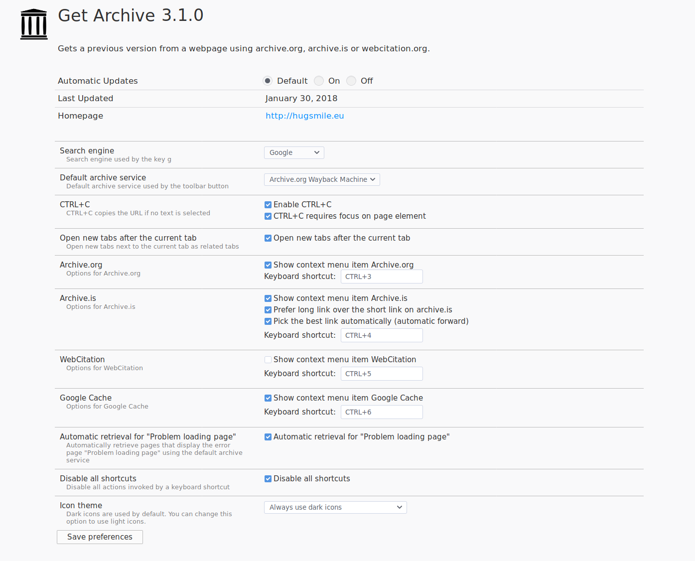
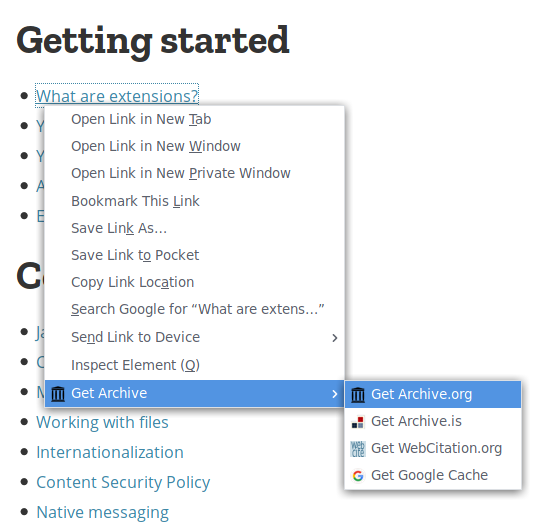
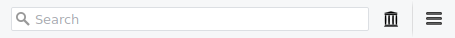
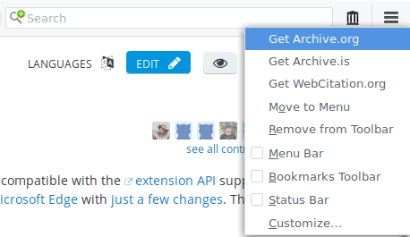

Get Archive
=============

Gets a previous version from a webpage using archive.org, archive.is, webcitation.org or Google Cache.

## How to use

* Right click a link, page or selection -> Get Archive -> Get Archive.org: an archived copy of the page opens in a new tab.
* Press shortcut 3 on an invalid page. An archived copy of the page opens in the current tab.
* Press shortcut 3 on an valid page. An archived copy of the page opens in a new tab.

## Features

* Support for archive.org, archive.is (archive.is/archive.li/archive.today), webcitation.org and Google Cache
* Shortcuts 3 (archive.org), 4 (archive.is), 5 (webcitation.org), 6 (Google Cache)
* Copy archived version URL to clipboard (invalid archived pages are not copied to the clipboard)
* Automatic forwarding to an archived page for archive.is, skipping the overview page (optional)
* Support "Server not found" Firefox error pages, including forwarding to the default archive service (new in Get Archive 3.0)
* Add long URL to history using the WebExtension history api if prefer long URL is enabled (new in Get Archive 3.0)
* Navigate between archive.org, archive.is, webcitation.org and Google Cache with ease (includes http and www. url detection)
* Copy current URL to clipboard using CTRL+C (requires at least Firefox version 51 where clipboardWrite support was introduced)
* Read from clipboard on INSERT and PAUSE/BREAK (requires at least version 54 since clipboardRead is supported since FF54)
* Open as related tabs (workaround for https://bugzilla.mozilla.org/show_bug.cgi?id=1238314)
* Copy PDF and TXT links late enough
* Protocol support: FTP (new in Get Archive 3.0), HTTP and HTTPS
* CTRL+3, CTRL+4, CTRL+5, CTRL+6 shortcuts can be customized
* Toolbar button with context menu items
* Context menu items for supported archive services (optional)
* Search with Google/DuckDuckGo/Bing function
* Integration with Special:LinkSearch page (MediaWiki)

## Notes
* Shortcuts do not work on Firefox error pages
* There is no statusbar icon, only a toolbar icon

## Shortcuts

| Feature | Keyboard shortcut | Comments
|---------------|----------|----------
| Search current URL with search engine | Alt+G | Google is the default search engine. The search engine can be changed in the preferences.
| Copy current URL to clipboard | CTRL+C | Copies the current URL.
| Copy current URL to clipboard and close tab | c | Only works when the focus is on the page element.
| Paste URL from clipboard | Pause/Break | Only works in Firefox >=54.
| Paste URL from clipboard | Insert | Only works in Firefox >=54. On nl.wikipedia.org, <!-- Archieflink: URL --> is used

## Options

If you change preferences, don't forget to click "Save preferences". The options page can be accessed at about:addons -> Extensions -> Get Archive -> Preferences.

Explanations:

| Setting | Values | Explanation
|-------------|-------------------|-------------------
| Search engine | Bing, DuckDuckGo or Google | Search engine used when pressing g on the keyboard.
| Default archive service |	Archive.org Wayback Machine, archive.is, webcitation.org or Google Cache | Search engine used when pressing g on the keyboard. It will use the current URL as the search term. This is useful for, among other things, finding PDFs and news articles.
| Enable CTRL+C | Checked or unchecked | Copy the current URL to the clipboard if no text is selected. Disable this option if you suddenly can't copy text anymore.
| CTRL+C requires focus on page element | Checked or unchecked | Safety measure: check if the focus is not in a textbox but on the page itself (whitespace) when pressing CTRL+C. If unsure, leave this checked.
| Open new tabs after the current tab |	Checked or unchecked | Open tabs after the current one instead of at the end.
| Show context menu item Archive.org | Checked or unchecked | Show Get Archive.org in the right click menu.
| Keyboard shortcut | 3 (digit or numpad)  CTRL+3 (default, can be changed to any keyboard combination) | Use Archive.org Wayback Machine for the current selection or page.
| Show context menu item Archive.is | Checked or unchecked | Show Get Archive.is in the right click menu.
| Prefer long link over the short link on archive.is | Checked or unchecked | https://archive.is/93uZq vs https://archive.is/2017.02.15-094424/https://developer.mozilla.org/en-US/Add-ons/WebExtensions/API/history (long link is more descriptive)
| Pick the best link automatically | Checked or unchecked | Automatic forward, so you don't have to press key 4 twice. This takes effect on the archive.is overview page, where we go to the detail (archived) page automatically by selecting the most appropriate archived version.
| Keyboard shortcut | 4 (digit or numpad) / CTRL+4 (default, can be changed to any keyboard combination*) | Use Archive.is for the current selection or page.
| Show context menu item WebCitation | Checked or unchecked | Show Get WebCitation.org in the right click menu.
| Keyboard shortcut | 5 (digit or numpad) / CTRL+5 (default, can be changed to any keyboard combination*) | Use WebCitation.org for the current selection or page.
| Show context menu item Google Cache |	Checked or unchecked | Show Get Google Cache in the right click menu.
| Keyboard shortcut | 6 (digit or numpad) / CTRL+6 (default, can be changed to any keyboard combination*) | Use Google Cache for the current selection or page.

*any keyboard combination means having at least one of these:
- A modifier key (Ctrl/Cmd, Alt/Option, Shift, Meta/OS/Win/Super/Hyper)
- A single character (modifier key is mandatory here)
- A single, whitespace character like Space, Enter/Return or Tab (modifier key is mandatory here) (overriding Ctrl+Tab and Ctrl+Shift+Tab is not supported)
- A function key (F1, F2, F3..)
- A media key
- A single key, like PageUp, PageDown, Insert, Home, End..

## Context menu items

## Toolbar icon

If you don't want a toolbar icon, customize the Firefox toolbar so the icon is gone. See [Customize Firefox controls, buttons and toolbars](https://support.mozilla.org/t5/Customize-controls-options-and/Customize-Firefox-controls-buttons-and-toolbars/ta-p/2715) at mozilla.org.

You can also change the toolbar icon color to white to have more contrast when using a dark theme.

## Toolbar icon (right click)

The same context menu items are also available under the toolbar icon upon a right click.

## Issues with The WayBack Machine
504 Gateway Time-out -> reload the page
