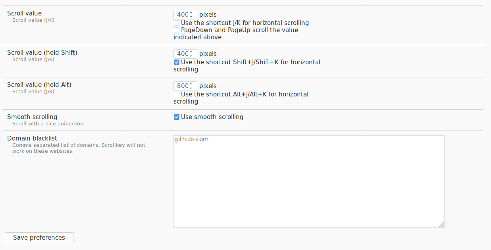

# Scrollkey

Scrollkey makes it possible to scroll a page with your keyboard instead of using your mouse. Included shortcuts: J/K, Shift+J/Shift+K and Alt+J/Alt+K.

## Why should I use this?

Are you tired of reaching for your mouse just to scroll a page?

Do you want to scroll faster or slower? Do you want to use smooth scrolling?

Scrollkey is just what you're looking for!

## How to use Scrollkey

Use j, shift+j or alt+j to scroll down.

Use k, shift+k or alt+k to scroll up.

Use gg to scroll to top.

Use GG to scroll to bottom.

The amount and direction of scroll can be configured in the options of Scrollkey.

## Options

