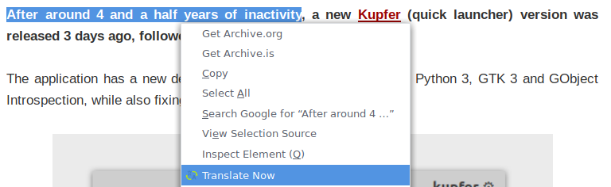
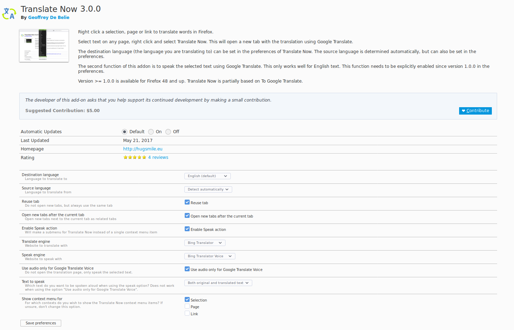

Translate Now
=============

Right click a selection, page or link to translate words in Firefox.

## Features

* Supports Google Translate, Deepl Translator and Bing Translator.
* Broad support for source and destination languages.
* Speak source text or destination text (translation) aloud using Google Translate Voice or Bing Translator Voice.
* Make a selection, translate the current page or translate linked page.
* Use the toolbar icon to translate texts and right click the toolbar icon to gain access to the preferences.
* Highly customizable.

If you enable Speak with Google Translate Voice, the context menu item changes into a submenu:

